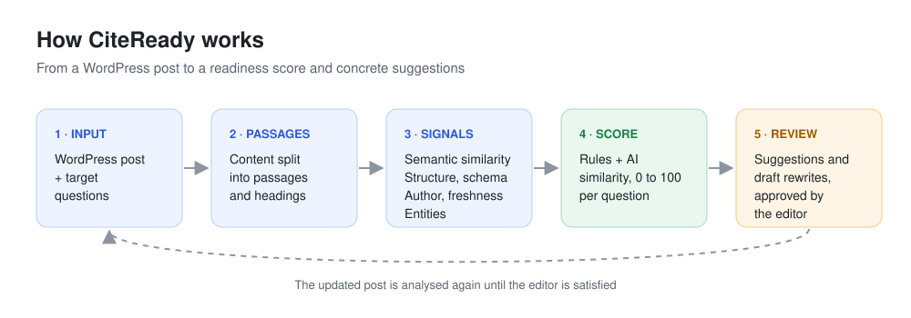
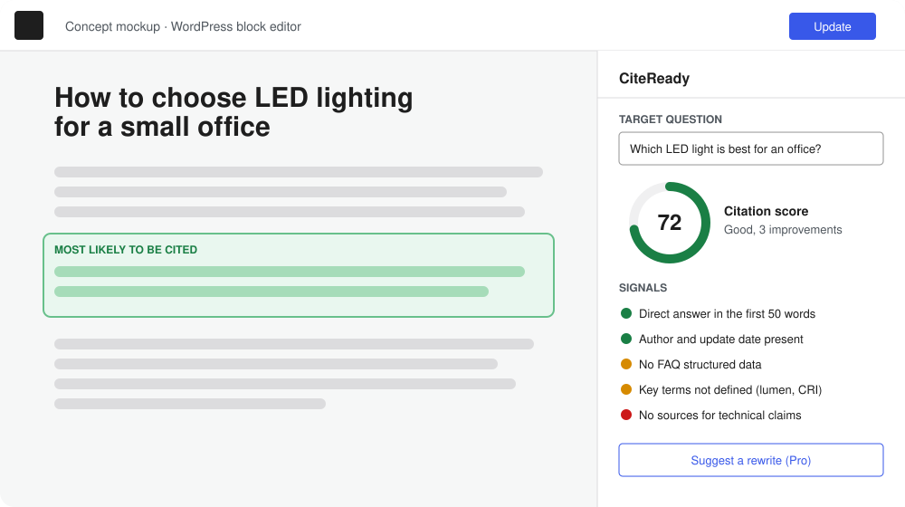

# CiteReady, making web content ready for AI citations

## Summary

CiteReady is a planned WordPress plugin that scores how ready a page is to be cited by AI answer engines (ChatGPT, Perplexity, Google AI Overviews) and suggests concrete edits that improve both classic SEO and Generative Engine Optimization (GEO).



## Background

More and more people get answers directly from AI assistants instead of clicking on search results. A page can rank well on Google and still never appear in an AI-generated answer, so the site loses visibility without knowing why. The problem affects every business that depends on organic traffic, and it grows as more search engines and assistants show AI-generated answers.

Problems the idea addresses:

* SEO tools measure rankings and clicks, and almost none check whether a page is easy for AI engines to quote
* GEO advice is scattered across articles and hard to apply page by page
* small businesses, freelancers and agencies cannot afford manual audits of hundreds of pages
* many pages written for keywords are hard for language models to extract, because the answer is buried under long intros or missing structure

Personal motivation. I have worked for over 20 years as an SEO and web consultant in Rome, and in the last year my clients keep asking the same question: "why does ChatGPT mention our competitors and not us?". I want to give them a concrete and measurable way to improve their pages.

## How is it used?

The user works on a post in WordPress and wants to know whether AI engines will use it as a source.

1. The user opens the post in the block editor and adds the questions the page should answer.
2. CiteReady splits the content into passages and compares each passage with each question.
3. The plugin returns a **readiness score from 0 to 100** for every question and highlights the passage most likely to be quoted.
4. The score comes with readable signals, such as "the answer appears after 300 words", "no author or update date", "missing FAQ or structured data", "key terms not defined".
5. On request, a language model drafts a rewrite of the weak passage. The editor sees the changes side by side and approves, edits or discards them. Nothing is published automatically.



*Concept mockup of the planned WordPress editor panel. The plugin is not developed yet.*

Users are SEO consultants, web agencies, editors and e-commerce owners. They need clear explanations more than technical metrics, support for languages other than English (Italian first), and full control over what gets published.

### AI setup in one minute

The AI features run on the user's own API key, so each site pays only for its own usage and the plugin has no hidden costs.

1. In the plugin settings the user picks an AI provider from a list (for example Anthropic, OpenAI or Google).
2. A direct link opens the provider page where the key is created.
3. The user pastes the key and clicks **Test connection**. Models are preselected, so no further configuration is needed.
4. Before each rewrite the plugin shows an estimate of the cost of the request.

Agencies that manage many sites can also set the key in `wp-config.php`, so it never appears in the admin area.

A simplified version of the scoring logic:

```python
from sentence_transformers import SentenceTransformer, util

model = SentenceTransformer("all-MiniLM-L6-v2")

question = "Which LED light is best for an office?"
passages = [
    "Our company was founded in 1998 and has always cared about quality.",
    "For an office, choose neutral white LED lights (4000K) with a CRI above 80.",
    "Contact us to receive a free quote for your project.",
]

# Semantic similarity between the question and each passage
similarity = util.cos_sim(model.encode(question), model.encode(passages))[0]
best = int(similarity.argmax())

# Rule-based signals for the best passage (1 = present, 0 = missing)
signals = {"answer_in_first_50_words": 1, "author_and_date": 1,
           "faq_schema": 0, "key_terms_defined": 0, "sources_cited": 0}
weights = {"answer_in_first_50_words": 0.30, "author_and_date": 0.15,
           "faq_schema": 0.20, "key_terms_defined": 0.20, "sources_cited": 0.15}

rules = sum(weights[k] * v for k, v in signals.items())
score = 40 * float(similarity[best]) + 60 * rules
print("Best passage: %d, readiness score: %.0f/100" % (best, score))
```

## Data sources and AI methods

CiteReady does not need its own training dataset. The data it works on is the content of the post being edited and the target questions entered by the user. The analysis combines transparent rules with pre-trained models, reached through the AI provider chosen by the user.

| Method | What it is used for |
| ----------- | ----------- |
| Rule-based signals | Checking answer position, headings, lists, schema.org markup, author and update date |
| Text embeddings | Measuring how well each passage answers each question (lexical matching when the provider offers no embeddings) |
| Named entity recognition, via the language model | Checking that key terms are present and defined |
| Large language model | Drafting rewrites and FAQ suggestions, always reviewed by a human |

The rules and their weights come from published GEO research and from SEO practice, and they can be updated as AI engines change.

## Challenges

* **The score measures readiness and gives no guarantee of citation.** AI engines are black boxes and change often, so the plugin must say so clearly and the rules need regular review.
* The rules reflect current research and practice. Only controlled tests on real pages can show which changes actually increase citations.
* Ethics. A tool like this could be used to produce manipulative or uniform content. CiteReady should reward accuracy, clarity and verified sources, and AI rewrites can introduce errors, so human approval stays mandatory.
* Privacy. Content is sent to the AI provider only when the user starts an AI action, and only after the site administrator has given consent. The plugin does not process personal data.
* Costs. API usage is paid by the site owner, so the plugin shows cost estimates and lets administrators set a monthly limit.

## What next?

* A free version on wordpress.org with the rule-based score, and a Pro version with the AI features
* A monitoring dashboard that tracks the score of all pages over time
* A/B tests on real pages to refine the rules and their weights
* Support for more languages and more AI providers
* Weights learned from the A/B test data with logistic regression, replacing the hand-picked ones

The next step is a beta version tested by a small group of editors and agencies.

## Acknowledgments

* Aggarwal et al., [GEO: Generative Engine Optimization](https://arxiv.org/abs/2311.09735), the research paper that inspired the idea
* [schema.org](https://schema.org) vocabulary for structured data
* Open source library [sentence-transformers](https://www.sbert.net)
